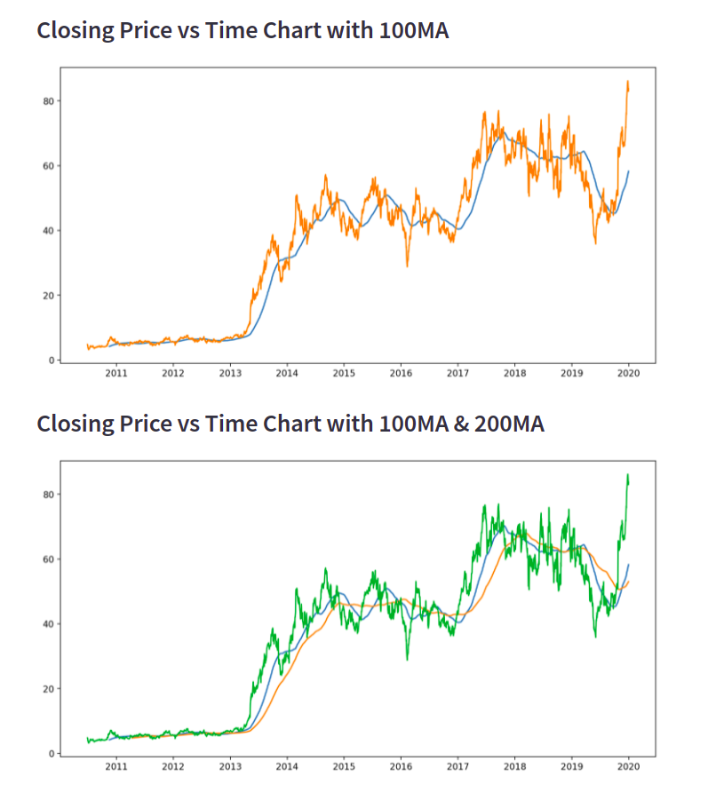

# Stock Trend Prediction using Stacked LSTM

Building an interactive machine learning app with Streamlit to forecast Stock Trend.

I have used Pandas datareader is a sub package that allows one to create a dataframe from various internet datasources like Yahoo Finance. Yahoo Finance provides data of stocks, financial news, press releases and financial reports of companies.

I used stacked LSTM rather than any other deep learning algorithm, as it eliminates the need for long term dependencies, thus proving memory and time efficient.

## Forecasting

